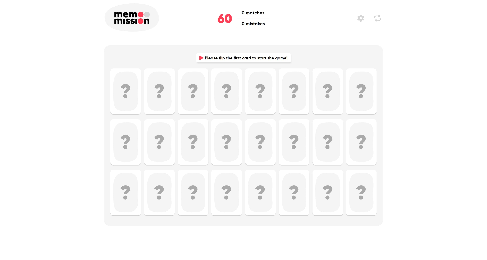
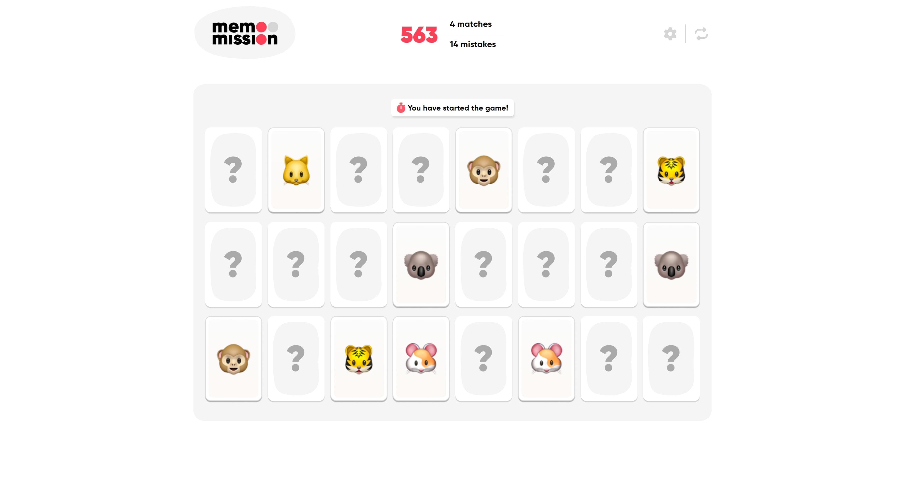
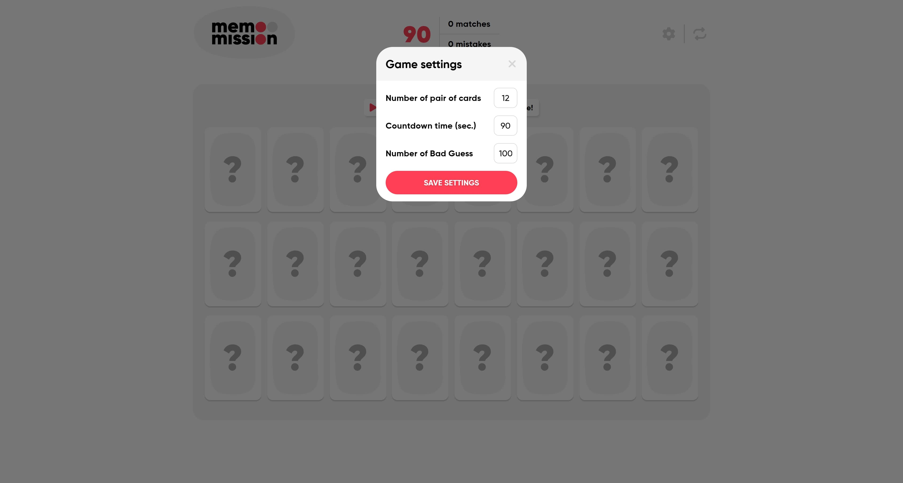
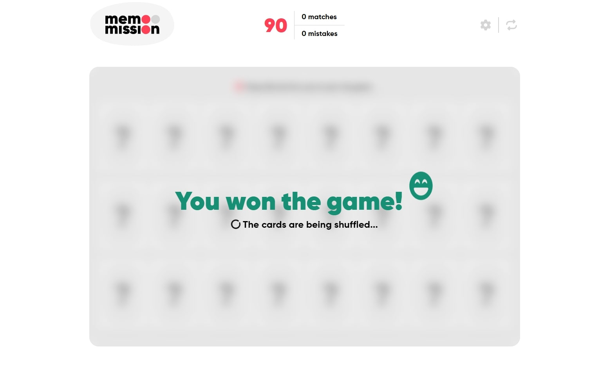
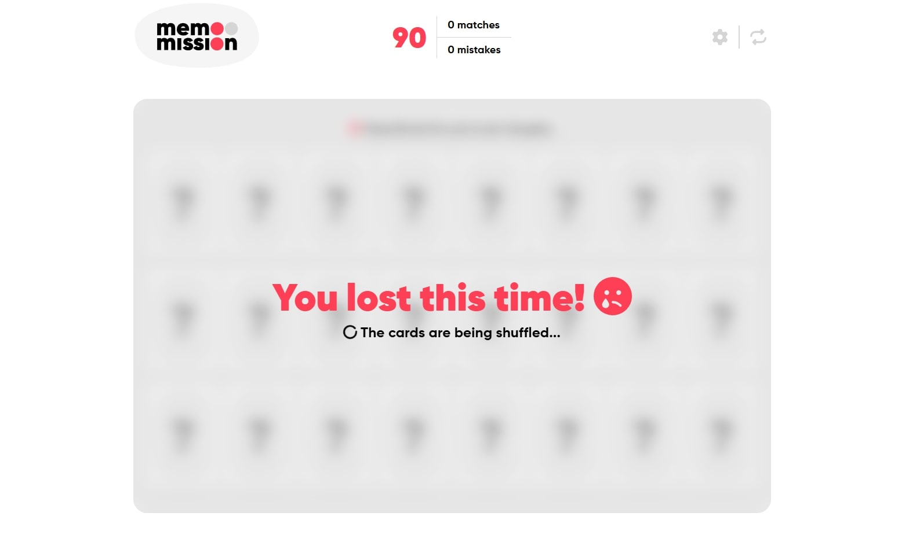

# Memo Mission

A customizable memory game built with React.

## Overview

Memo Mission is a simple React game with the following requirements
- Render memory cards that can be swapped.
- If a pair is found, leave it swapped.
- If it's not a match, auto-swap back within a specified interval.
- Implement a countdown timer that starts when the game begins and stops
when the game ends.
- Implement animations for card swapping to enhance the user experience.
- The cards should be shuffled before every game
- Create a settings form for the game
- Allow users to define: The number of cards, Countdown time in seconds, Number of bad guesses

## Tech Stack
- [React](https://react.dev/) – UI library for building interactive user interfaces
- [Vite](https://vitejs.dev/) – Fast development server and build tool
- [TypeScript](https://www.typescriptlang.org/) – Typed superset of JavaScript
- [Redux Toolkit](https://redux-toolkit.js.org/) – State management for React apps
- [Font Awesome](https://fontawesome.com/) – Icon library for scalable vector icons
- [JavaScript (ES6+)](https://developer.mozilla.org/en-US/docs/Web/JavaScript) – Modern JavaScript features

### Installation

1. Install dependencies:

   ```bash
   npm install
2. Run the development server:

   ```bash
   npm run dev
3. Test the app
   ```bash
   npm run test
## Screenshots

Listing the cards


Keeping swapped cards


Game settings


Won the game


Lose the game
